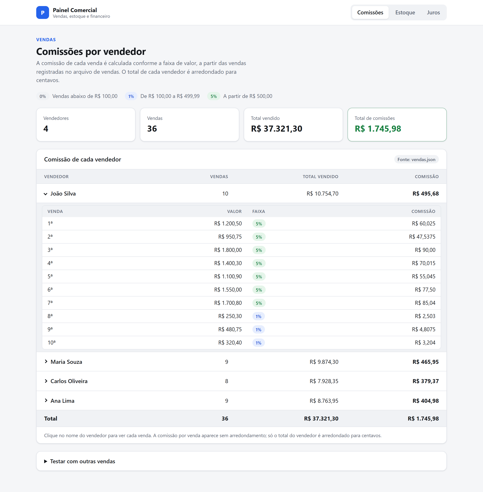
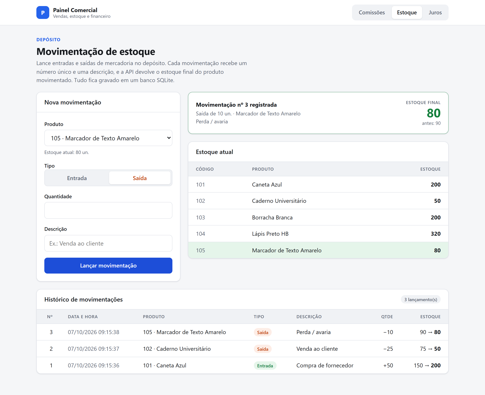
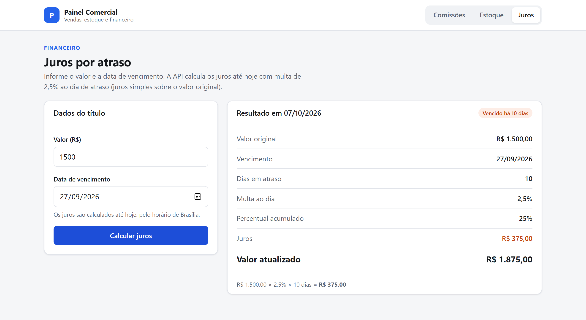
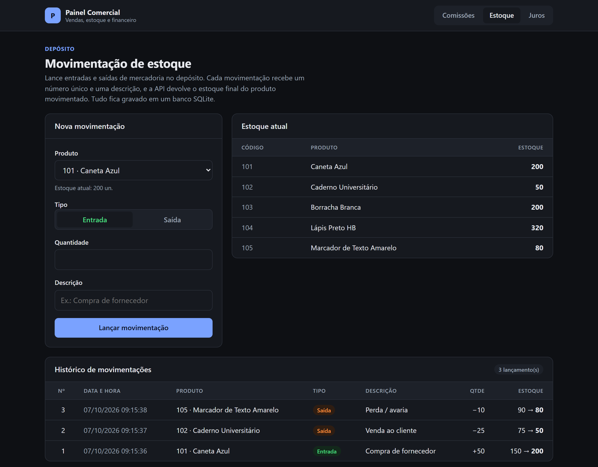
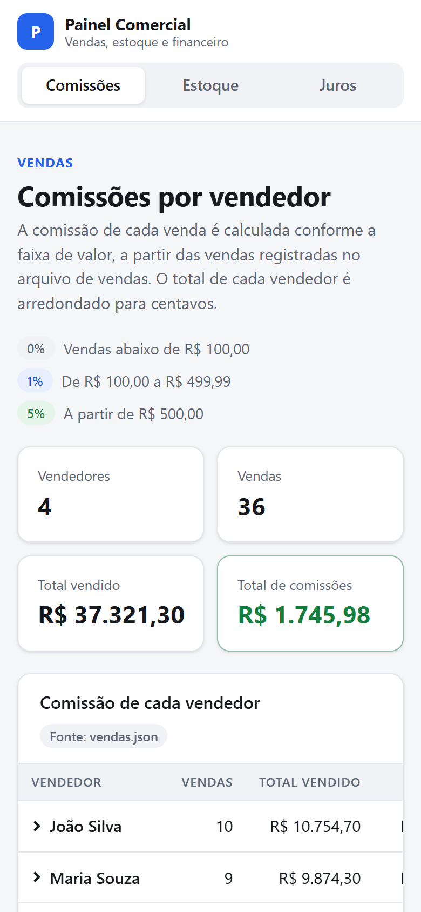

# Painel Comercial

Painel web para o time comercial: **comissões de vendas**, **movimentação de estoque** e
**cálculo de juros por atraso**. As regras de negócio ficam numa API em **ASP.NET Core (.NET 10)**,
o estoque é gravado em **SQLite** (EF Core) e a interface é feita em **Angular 22**.




## Sumário

- [Funcionalidades](#funcionalidades)
- [Telas](#telas)
- [Primeiros passos](#primeiros-passos)
- [Configuração](#configuração)
- [Testes](#testes)
- [API](#api)
- [Estrutura do projeto](#estrutura-do-projeto)
- [Regras de negócio](#regras-de-negócio)
- [Validação e segurança](#validação-e-segurança)
- [Solução de problemas](#solução-de-problemas)

## Funcionalidades

| Módulo | O que faz |
|---|---|
| **Comissões** | Lê as vendas de `vendas.json` e calcula a comissão de cada venda pela faixa de valor (0%, 1% ou 5%), com o total por vendedor. Um editor permite recalcular com outras vendas. |
| **Estoque** | Lança entradas e saídas de mercadoria. Cada movimentação recebe um número único e uma descrição, e a resposta traz o estoque final do produto. O histórico fica gravado no banco. |
| **Juros** | A partir de um valor e da data de vencimento, calcula os juros até hoje com multa de 2,5% ao dia de atraso. |

## Telas

**Estoque:** formulário de movimentação, estoque atual e histórico gravado no banco.



**Juros:** cálculo detalhado dos juros de um título vencido.



**Tema escuro e celular:** o tema acompanha a preferência do sistema, e o layout se adapta a telas pequenas.

<table>
  <tr>
    <td width="72%"></td>
    <td width="28%"></td>
  </tr>
</table>

## Primeiros passos

### 1. Instale os pré-requisitos

| Ferramenta | Versão | Download |
|---|---|---|
| .NET SDK | 10 | <https://dotnet.microsoft.com/download/dotnet/10.0> |
| Node.js | 22.22+ ou 24.15+ (exigência do Angular 22) | <https://nodejs.org> |
| Git | qualquer versão recente | <https://git-scm.com> |

No Windows, dá para instalar tudo pelo terminal:

```bash
winget install Microsoft.DotNet.SDK.10 OpenJS.NodeJS.LTS Git.Git
```

Feche e abra o terminal depois de instalar e confira as versões:

```bash
dotnet --version
```

```bash
node --version
```

Banco de dados não precisa instalar: o SQLite é um arquivo criado automaticamente pela API.

### 2. Clone o repositório

```bash
git clone https://github.com/SirDarky/painel-comercial.git
```

```bash
cd painel-comercial
```

### 3. Suba a API (terminal 1)

```bash
dotnet run --project backend/src/PainelComercial.Api
```

Na primeira execução, a API:

1. baixa os pacotes NuGet;
2. cria o banco `backend/src/PainelComercial.Api/estoque.db`, aplicando as migrations;
3. carrega os produtos de `Data/estoque.json`.

A API sobe em **http://localhost:5230**, e a documentação interativa fica em
**http://localhost:5230/scalar**.

### 4. Suba o frontend (terminal 2)

```bash
cd frontend
```

```bash
npm install
```

```bash
npm start
```

### 5. Abra o painel

Acesse **http://localhost:4200**. O `ng serve` repassa as chamadas `/api` para a API
(`frontend/proxy.conf.json`), então não é preciso configurar CORS.

> **Dica:** para voltar o estoque ao estado original, pare a API e apague o arquivo
> `backend/src/PainelComercial.Api/estoque.db`. Ele é recriado na próxima execução.

## Configuração

As opções da API ficam em `backend/src/PainelComercial.Api/appsettings.json`:

| Chave | Padrão | Para que serve |
|---|---|---|
| `ConnectionStrings:Estoque` | `Data Source=estoque.db` | Arquivo do banco SQLite. Caminhos relativos partem da pasta da API. |
| `FusoHorario` | `America/Sao_Paulo` | Fuso usado para saber qual é a data de "hoje" (juros e data/hora das movimentações). |
| `LimitesDeRequisicao:RequisicoesPorMinuto` | `120` | Limite geral de requisições por IP. |
| `LimitesDeRequisicao:EscritasPorMinuto` | `30` | Limite por IP para as rotas que gravam ou processam dados (`POST`). |

A porta da API está em `Properties/launchSettings.json`. Se ela mudar, atualize também o
`frontend/proxy.conf.json`.

### Migrations

A API aplica as migrations pendentes sozinha ao iniciar. Para criar uma nova depois de alterar
o modelo, use a ferramenta `dotnet-ef`, declarada em `backend/dotnet-tools.json`:

```bash
cd backend
dotnet tool restore
dotnet ef migrations add NomeDaMudanca --project src/PainelComercial.Api
```

## Testes

```bash
dotnet test backend
```

```bash
npm --prefix frontend test
```

- **Backend: 62 testes** (xUnit):
  - regras de comissão, estoque e juros;
  - concorrência (100 saídas em paralelo disputando 75 unidades);
  - idempotência, validação e rate limit;
  - API de ponta a ponta com `WebApplicationFactory`.

  Cada teste usa um arquivo SQLite temporário próprio e não toca no `estoque.db`.
- **Frontend: 14 testes** (Vitest), cobrindo as três telas e o tratamento de erros da API.

O arquivo `backend/src/PainelComercial.Api/PainelComercial.Api.http` traz requisições prontas para
testar a API pelo VS Code, Visual Studio ou Rider.

## API

| Método | Rota | Descrição |
|---|---|---|
| `GET` | `/api/comissoes` | Comissão de cada vendedor, calculada a partir de `vendas.json`. |
| `GET` | `/api/comissoes/vendas` | Vendas cadastradas em `vendas.json`. |
| `POST` | `/api/comissoes/calculo` | Calcula comissões para as vendas enviadas (`{ "vendas": [...] }`). |
| `GET` | `/api/estoque/produtos` | Produtos com o estoque atual. |
| `GET` | `/api/estoque/movimentacoes?codigoProduto=101` | Histórico de movimentações (filtro opcional). |
| `GET` | `/api/estoque/movimentacoes/{id}` | Uma movimentação. |
| `POST` | `/api/estoque/movimentacoes` | Lança entrada ou saída e devolve o estoque final. Aceita o cabeçalho `Idempotency-Key`. |
| `GET` | `/api/juros?valor=1000&dataVencimento=2026-09-26` | Juros até hoje para o valor e o vencimento informados. |

Exemplo de lançamento:

```http
POST /api/estoque/movimentacoes
Content-Type: application/json
Idempotency-Key: 6f1c2a9e-0b7d-4d1e-9c3a-2b5f8e7d4a10

{ "codigoProduto": 101, "tipo": "Saida", "quantidade": 10, "descricao": "Venda ao cliente" }
```

```json
{
  "id": 1,
  "codigoProduto": 101,
  "descricaoProduto": "Caneta Azul",
  "tipo": "Saida",
  "quantidade": 10,
  "descricao": "Venda ao cliente",
  "dataHora": "2026-10-07T09:15:36-03:00",
  "estoqueAnterior": 150,
  "estoqueFinal": 140
}
```

Os erros seguem o padrão ProblemDetails (RFC 9457), com a mensagem em português no campo
`detail` ou, nos erros de validação, em `errors`.

## Estrutura do projeto

```
backend/
  src/PainelComercial.Api/
    Data/                 vendas.json e estoque.json (dados iniciais)
    Comissoes/            CalculadoraComissao (faixas de comissão) + controller
    Estoque/              EstoqueDbContext (EF Core), EstoqueService (regra de saldo) + controller
    Juros/                CalculadoraJuros (2,5% ao dia) + controller
    Migrations/           tabelas Produtos e Movimentacoes
    Comum/                leitura dos JSON, erros (ProblemDetails), validação, rate limit e fuso
  tests/PainelComercial.Tests/   xUnit: unitários e integração (WebApplicationFactory + SQLite)
frontend/
  src/app/
    comissoes/ estoque/ juros/   uma tela e um serviço de API por módulo
    shared/erro-api.ts           converte erros da API em mensagens para o usuário
docs/imagens/                    capturas de tela usadas neste README
```

As regras ficam fora dos controllers (`CalculadoraComissao`, `EstoqueService`, `CalculadoraJuros`),
o que facilita testar e reaproveitar. Os controllers só fazem a ponte com a web.

## Regras de negócio

### Comissões
- Faixas por venda: **abaixo de R$ 100,00 → 0%**, **de R$ 100,00 a R$ 499,99 → 1%**,
  **a partir de R$ 500,00 → 5%**.
- A comissão de cada venda é calculada com precisão total (`decimal`), e **só o total de cada
  vendedor é arredondado para centavos**. Arredondar venda a venda acumularia erro: o João, por
  exemplo, ficaria com R$ 495,69 em vez de R$ 495,68.
- Resultado com as vendas de `vendas.json`:

  | Vendedor | Vendas | Total vendido | Comissão |
  |---|---:|---:|---:|
  | João Silva | 10 | R$ 10.754,70 | **R$ 495,68** |
  | Maria Souza | 9 | R$ 9.874,30 | **R$ 465,95** |
  | Carlos Oliveira | 8 | R$ 7.928,35 | **R$ 379,37** |
  | Ana Lima | 9 | R$ 8.763,95 | **R$ 404,98** |
  | **Total** | 36 | R$ 37.321,30 | **R$ 1.745,98** |

### Estoque
- **Cada movimentação tem:**
  - um **número único e sequencial**, gerado pelo banco (`AUTOINCREMENT`, nunca reaproveitado);
  - o **tipo**: `Entrada` ou `Saida`;
  - a quantidade;
  - uma **descrição** livre que identifica a operação, como "Compra de fornecedor", "Venda ao cliente" ou "Perda / avaria".
- A resposta traz o **estoque final do produto** (e o anterior). Uma saída maior que o saldo é
  recusada com HTTP 422.
- **Concorrência:** o saldo é alterado por um `UPDATE` condicional
  (`... SET Estoque = Estoque - @qtd WHERE CodigoProduto = @codigo AND Estoque >= @qtd`), e a
  movimentação é gravada na mesma transação. Duas saídas simultâneas nunca deixam o estoque
  negativo, mesmo com várias instâncias da API usando o mesmo banco. Como última barreira, a tabela
  tem `CHECK (Estoque >= 0)`.
- O histórico funciona como auditoria: não é possível apagar um produto que tenha movimentações.

### Juros
- **Juros simples** de 2,5% sobre o valor original por dia de atraso:
  `juros = valor × 2,5% × dias em atraso`, arredondado para centavos.
- Os dias são contados a partir do dia seguinte ao vencimento. No dia do vencimento, ou antes
  dele, não há juros.
- "Hoje" é a data da API no fuso configurado (`America/Sao_Paulo`), não a do navegador.

## Validação e segurança

| Proteção | Como funciona |
|---|---|
| **Validação no front e no back** | O front bloqueia dados inválidos antes de enviar (campos obrigatórios, quantidade inteira entre 1 e 1.000.000, saída acima do saldo, valor máximo). A API valida tudo de novo, porque o front pode ser contornado. |
| **Mensagens de erro** | Respostas 400 em português (`"Dados inválidos."`), indicando o campo e sem expor nomes de classes ou detalhes internos. |
| **Limites de tamanho** | Corpo da requisição com no máximo 1 MB (HTTP 413), até 10.000 vendas por cálculo, nome do vendedor com até 100 caracteres e descrição com até 200. |
| **Rate limit por IP** | 120 requisições por minuto em qualquer rota e 30 por minuto nos `POST`. Acima disso a API responde HTTP 429 com `Retry-After`. |
| **Lançamento duplicado** | Com o cabeçalho `Idempotency-Key`, repetir a mesma requisição (duplo clique, nova tentativa após falha de rede) devolve a movimentação já lançada. A mesma chave com dados diferentes devolve HTTP 409. O frontend gera e reaproveita a chave automaticamente. |
| **Banco de dados** | Consultas parametrizadas pelo EF Core (sem SQL injection), `CHECK (Estoque >= 0)` e índice único para a chave de idempotência. |

**Antes de publicar em produção, ainda faltam:**
- autenticação (por exemplo, JWT);
- HTTPS e cabeçalhos de segurança;
- `ForwardedHeaders`, caso a API fique atrás de um proxy. Sem isso, o rate limit enxerga o IP do proxy, e não o de cada cliente.

## Solução de problemas

| Problema | O que fazer |
|---|---|
| `dotnet` ou `node` não é reconhecido | Feche e abra o terminal depois de instalar, para o `PATH` ser atualizado. |
| Porta 5230 ou 4200 em uso | Encerre o processo que usa a porta ou troque a porta (veja [Configuração](#configuração)). |
| A tela mostra "Não foi possível falar com a API" | A API não está rodando. Suba-a com `dotnet run --project backend/src/PainelComercial.Api`. |
| HTTP 429 durante os testes manuais | O limite de requisições foi atingido. Espere o tempo do `Retry-After` ou aumente os valores de `LimitesDeRequisicao`. |
| No Windows, o build do Angular falha com *"An Application Control policy has blocked this file"* | O **Smart App Control** bloqueia o binário nativo do `oxc-parser`. O projeto já inclui a versão WebAssembly oficial (`@oxc-parser/binding-wasm32-wasi`, com um `overrides` do `@emnapi` em `frontend/package.json`), que é usada automaticamente nesse caso. Ao atualizar o Angular, mantenha a versão desse pacote igual à do `oxc-parser` (`npm ls oxc-parser`). |
